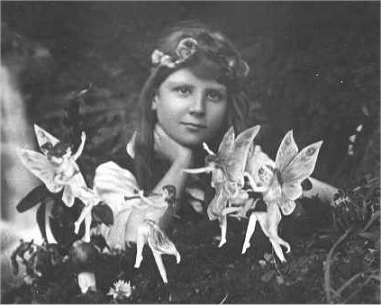

# The Case of the Cottingley Faeries Bibliography

**The Case of the Cottingley Fairies**
Joe Cooper

**The Coming of the Fairies**
[Sir Arthur Conan Doyle](https://www.gutenberg.org/ebooks/47506)

**The Doyle Diary**
[Charles Altamont Doyle](https://archive.org/details/doylediarylastgr0000doyl)

**The History of Spiritualism, Vol. 1**
[Sir Arthur Conan Doyle](https://gutenberg.net.au/ebooks03/0301051h.html)

**The History of Spiritualism, Vol. 2**
[Sir Arthur Conan Doyle](https://gutenberg.net.au/ebooks03/0301061h.htm)

**The Man Who Created Sherlock Holmes: The Life and Times of Sir Arthur Conan Doyle**
Andrew Lycett