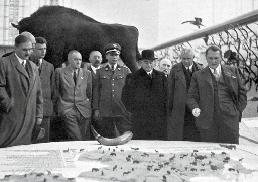

# Deextinction Nightmare Part 1 - Nazi Cows Bibliography

**How to Tame a Fox (and Build a Dog): Visionary Scientists and a Siberian Tale of Jump-Started Evolution**
Lyudmila Trut

**Animals My Adventure**
Lutz Heck

**Cow**
Hannah Velten

**Horse**
Elaine Walker

**The History of Four Footed Beasts And Serpents**
[Conrad Gessner](https://archive.org/details/historyoffourfoo00tops/mode/2up)

**On Aggression**
[Konrad Lorenz](https://archive.org/details/onaggression00lore)

**Breeding-back Wild Beasts: Aurochs, wild horse and quagga**
Daniel Foidl

**Resurrection Science: Conservation, De-extinction and the Precarious Future of Wild Things**
M.R. O’Connor