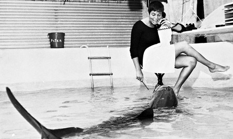

# Evil Neuroscience Part 1 - Popping Whale Brains and Suffocating Dolphins Bibliography

**Man and Dolphin: Adventures of a New Scientific Frontier**
[John C Lilly](https://archive.org/details/mandolphin00lill)

**The Mind of the Dolphin: A Nonhuman Intelligence**
[John C Lilly](https://archive.org/details/mindofdolphin00lill)

**Is Anyone Out There? The Scientific Search for Extraterrestrial Intelligence**
Frank D. Drake

**The Cosmic Connection: An Extraterrestrial Perspective**
[Carl Sagan](https://archive.org/details/cosmicconnection0000unse_q9a7)