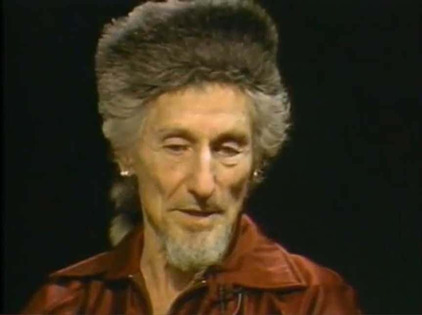

# Evil Neuroscience Part 2 - ECCO Chamber Bibliography

**Programming and Metaprogramming in the Human Biocomputer: Theory and Experiments**
[John C Lilly](https://archive.org/details/programmingmetap00lill_0)

**The Center of the Cyclone: An Autobiography of Inner Space**
[John C Lilly](https://archive.org/details/centerofcyclonea00lillrich)

**The Deep Self: Profound Relaxation and the Tank Isolation Technique**
[John C Lilly](https://archive.org/details/deepselfprofound00lill)

**The Scientist: A Metaphysical Autobiography**
[John C Lilly](https://archive.org/details/scientistnovelau00lill)

**KUBARK Counterintelligence Interrogation, 1963**
U.S. Central Intelligence Agency

**Special Considerations of Modified Human Agents as Reconnaissance and Intelligence Devices**
John C Lilly