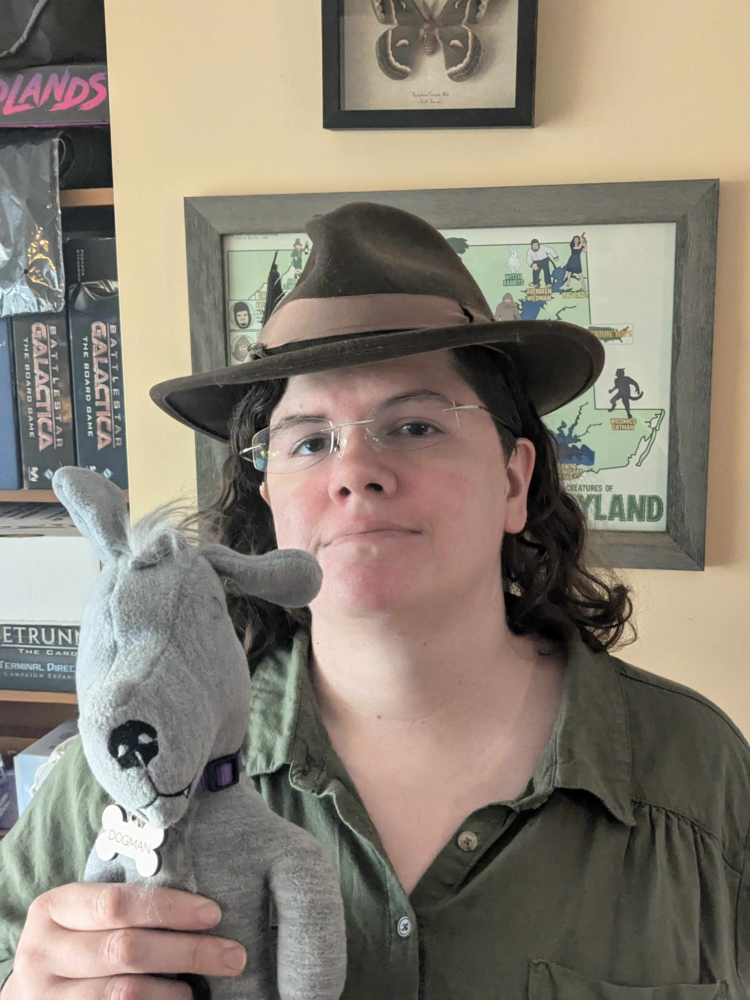

# Holistic Horrors - Tails and Tales

> *This article was originally featured in the [Horror Writers Association](https://horror.org/) June 2026 Newsletter as part of the Mental Health Initiative's Holistic Horrors series.*

## Tails and Tales

*Jack LaRoche*

In retrospect, there were signs from the beginning that I wasn’t quite “normal.” I always identified with the monster in every piece of horror media I encountered. If there wasn’t a monster, I saw myself reflected in whoever filled an outsider role. The character was usually male. With the benefit of hindsight, I can also say they were usually queer-coded with a fair bit of confidence. Tobias, from Katherine Applegate’s wonderful Animorph series, was the clearest example of this from my childhood. Neither hawk nor human, but a trans allegory all the same. Tragic and isolated, alone but still fighting for what he believed in. A romantic. It was only natural that as I got older the Wolfman stole my bleeding heart.

I was diagnosed with depression and anxiety as a teen. It wasn’t until my mid-thirties that I got the Autism and ADHD diagnoses. Similarly, I knew that I identified as bisexual in my teens, but I didn’t become comfortable identifying as non-binary until my thirties. As is often the problem, knowing about the existence of two-spirit identities didn’t make it any easier to accept myself as being part of them.

Everyone I’ve told about the autism diagnosis was surprised, but not for the reason I thought.

“What do you mean ‘just diagnosed’? You didn’t already know?” 

No, no I didn’t.

And, yeah, coming out as non-binary brought the same general reaction from people around me. 

“It’s about time.” 

That’s the frustrating thing about life, I guess. You have to figure things out in your own time. Even if you see the path, you still have to set your foot on it and get walking.

For people assigned female at birth, one of the telltale signs that you might be on the spectrum is how well you get along with animals. That and hyperlexia—an intense fascination and ability with words and language. In one fell swoop, two preternatural gifts of mine were explained by a simple diagnosis. It was both liberating and isolating. 

I’ve spent my whole life understanding myself through the lens of the non-human animal. The tragedy of the Wolfman spoke to me, regardless of the way it was told. The futile struggle for control against the self and the all-too-natural impulses were riveting, and something I dealt with every day. The philosophical struggle to do good in spite of myself was borne from my animal self as much as it was from the Christian guilt, wasn’t it? How much would be ruined if I was my authentic self? 

I’ve spent most of my life working with animals. They’re easy to understand. Many of the life lessons that people learned through friendships and relationships I was able to get through this work with animals. Taming the eastern cottontail I caught as a child taught me a lot about patience and processing grief, a lesson I learned again and again through rescuing hedgehogs as the years went on. Rats and coyotes taught me about the importance of community, and keeping a regular schedule, among many other things.

Rescuing hedgehogs is a lot like writing. When you tell people these are what you’re doing with your time, people will react with surprise and expect you to explain yourself. What do you mean hedgehogs? What do you write? There is hesitation, and perhaps a bit of alarm when you tell them that this is the path your life has taken. Something must have happened to get you here, right? Who in their right mind would be working with hedgehogs? Who would choose to write? Let alone the most dreaded outcome: both?

Hedgehogs are strange animals. They’re covered in spines, and those spines do hurt if they hit you the right way. Unlike a porcupine’s, they are not hooked but instead flat on either side. A porcupine can only stab you once, the hooked quill will stick in your skin and your quick jerk will rip it out of the animal’s body. A hedgehog can hurt you again and again with the same quill until it sheds it naturally. There’s a lesson to be had in this. You handle the hedgehog with care, but always without gloves. If you wear gloves, the hedgehog will learn that it can bite you without it causing harm. You have to offer up a bit of flesh and a bit of blood to earn the animal’s trust. There’s a lesson in that, too.

Writing is a lot like working with hedgehogs, or any animal, really. Writing horror even more so. Being part of the HWA has involved learning the difficult lesson that any good writing involves giving up a bit of skin and blood, too. Writing should hurt, and if you do it well, it keeps hurting. People on the outside will think what you are doing is cool, but in reality what you are doing is shining light on the darkest parts of yourself over and over again. You need to be authentic. Is anything more frightening than that?

Both professions are fundamentally isolating. If you are not toiling away with only animals for company, you are bent over a journal or laptop with just the voices in your head. Both are professions rife with loss and struggle as well. The highs are high: that animal close to death might make a full recovery, and you might sell that difficult manuscript. The lows are devastating: a single mistake results in death, and the repeated rejections of submission are often the death of hope and dreams. The HWA showed me that there can be community in this. 

My identity: my mental health diagnoses, my gender identification and sexuality, as well as my mixed race were all isolating factors. Going to StokerCon and becoming involved with the Mental Health Initiative showed me that they did not have to be. The horror community is one that challenges you to be true to yourself, and all of the unique aspects of what makes you, you. It invites you to speak the unvarnished truth and asks you for more, rather than less. Every time I log into a Larks & Katydids meeting or step foot on the StokerCon floor, I know that I am among friends who accept me for who and what I am, and who are waiting to hear another unique story.

Likewise, the *Animorphs* books by Katherine Applegate taught me a similar message. No matter why you feel that the world is against you, there will be those who accept you—the whole you—for who you are. There is strength in community, no matter how small, and there is beauty in being true to yourself. It was life-changing to find those books as a child and grow up with those messages in my mind. Genre fiction makes a difference, and I hope that my words will have a similar impact on others in time. You matter. Keep writing. 

{fig-align="center" width=50%}

Jack LaRoche is a Cajun writer of Blackfeet, Cherokee, and Scottish descent. They were born in St. Landry Parish, Louisiana and currently live near Baltimore, Maryland. They’ve been involved in exotic animal and wildlife rehabilitation for over twenty years, including several years spent with the Urban Coyote Research Project in Montana. Their current writing is primarily folklore based and can be heard on the QAA podcast. You can follow them at [CoyoteJacques](https://x.com/coyotejacques) on X or [CoyoteSpeaks](https://bsky.app/profile/coyotespeaks.bsky.social) on BlueSky.
